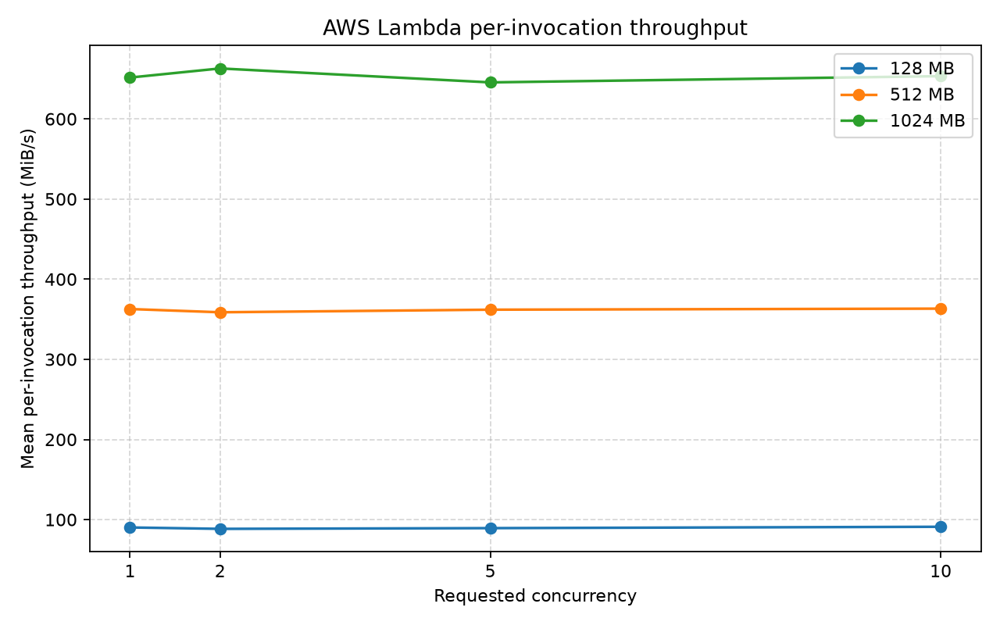
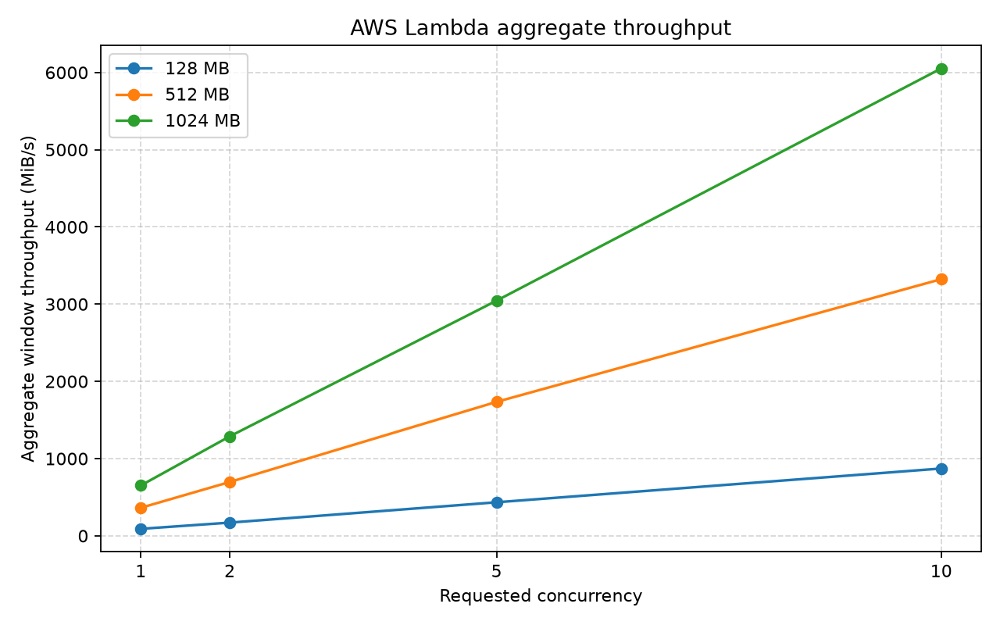
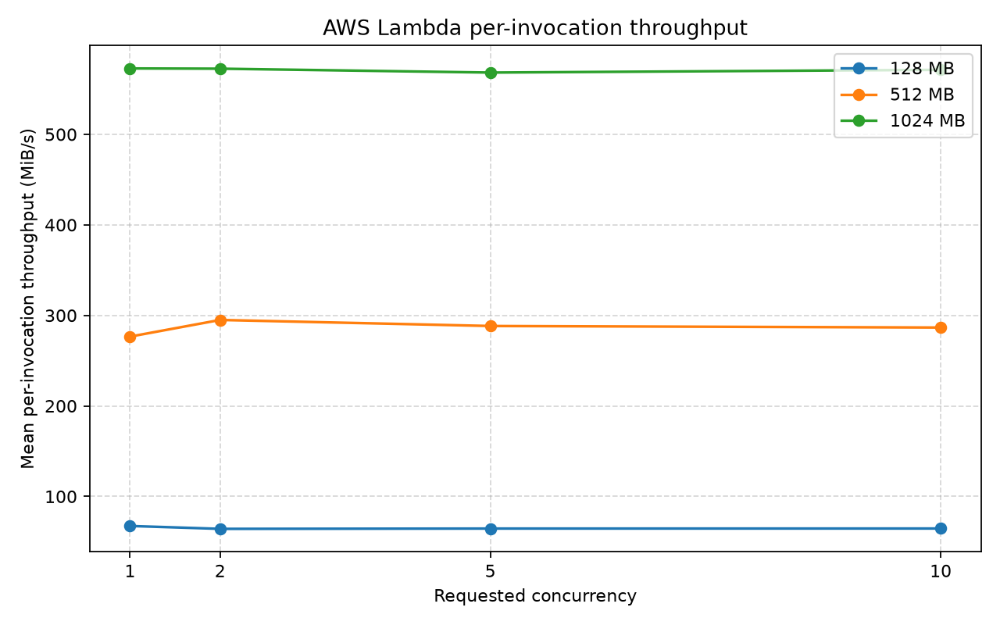
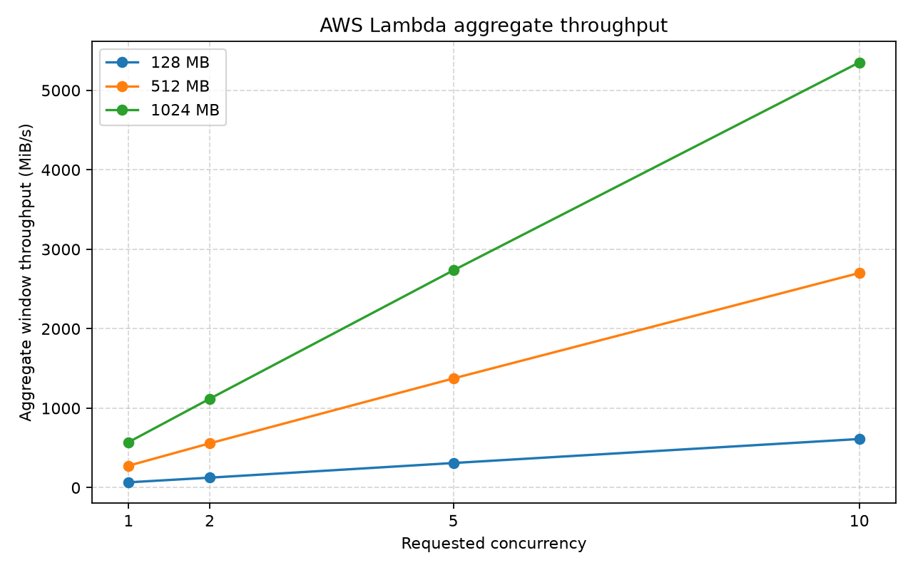
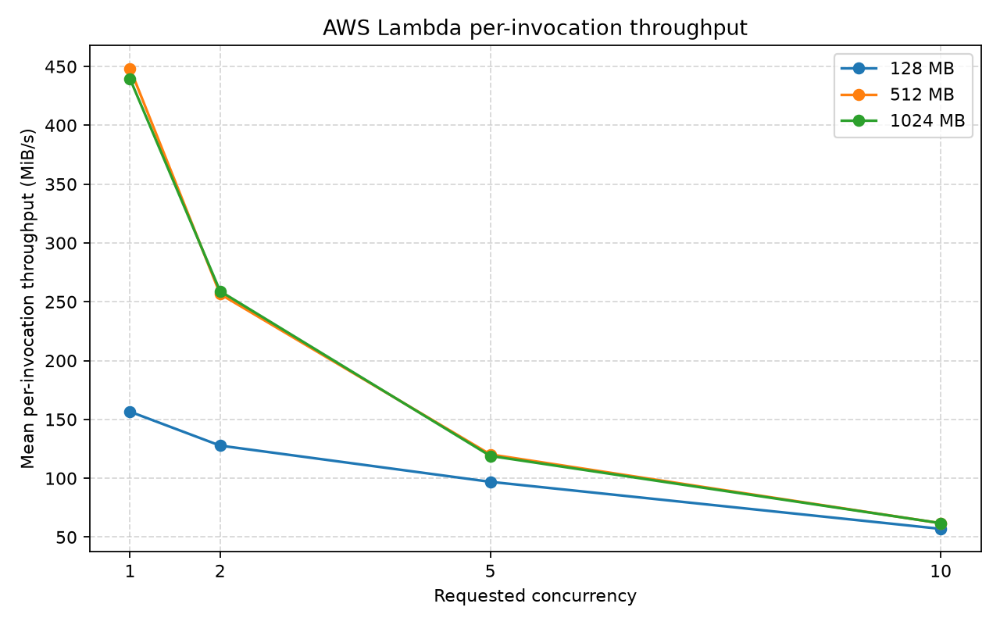
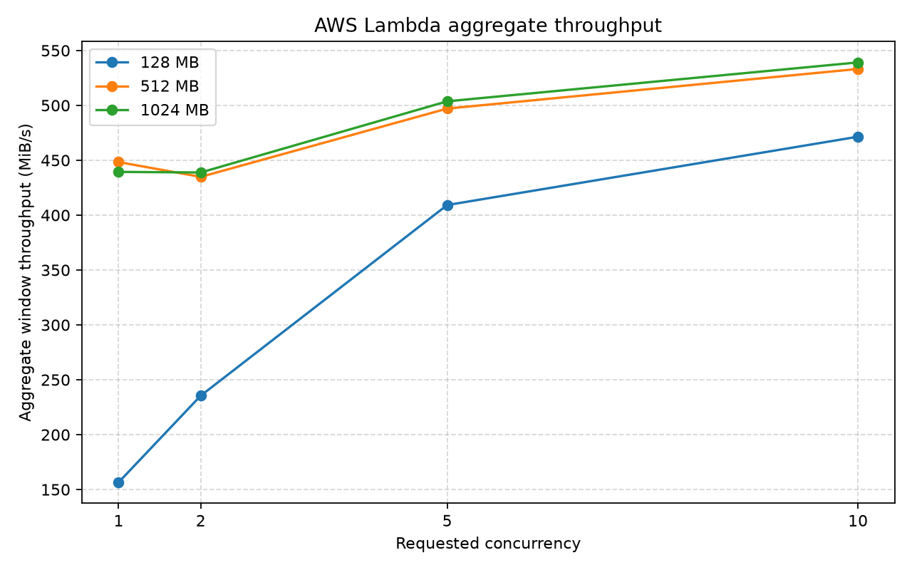
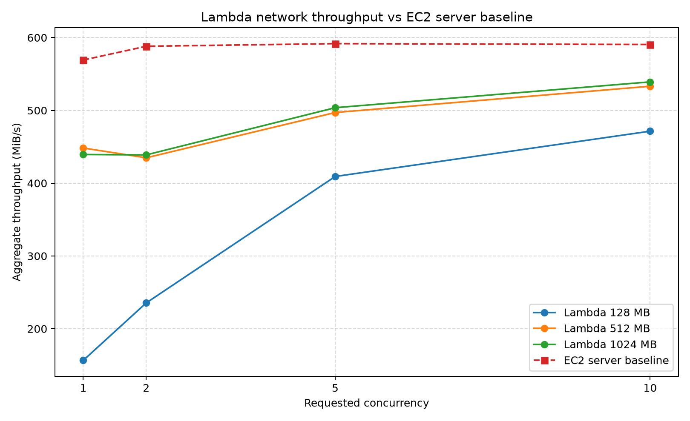
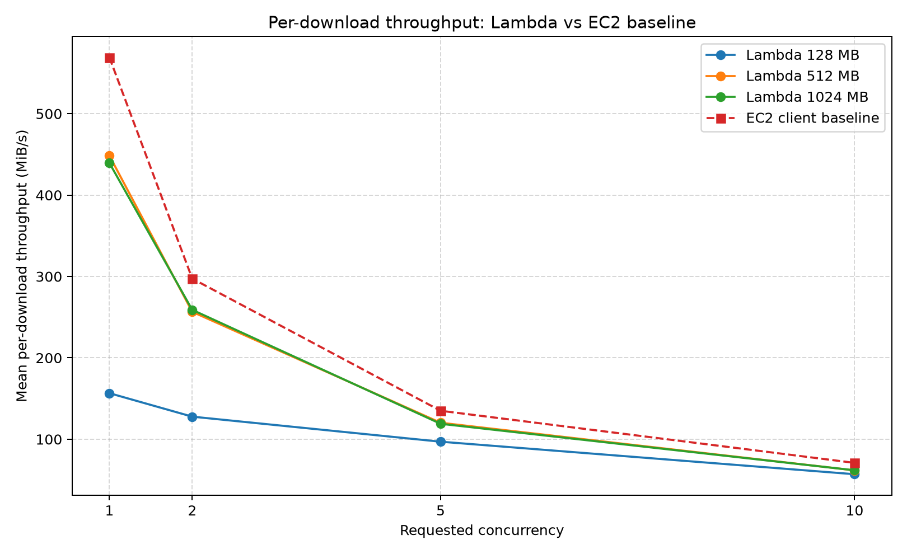

# AWS Lambda I/O Performance Experiment

현재 AWS Lambda 환경에서 함수 메모리와 요청 동시성이 `/tmp` 디스크 I/O 및 네트워크 처리량에 미치는 영향을 측정한 실험이다.

이 실험은 다음 두 논문에서 출발했다.

1. **Peeking Behind the Curtains of Serverless Platforms**  
   Liang Wang et al., USENIX ATC 2018
2. **Firecracker: Lightweight Virtualization for Serverless Applications**  
   Alexandru Agache et al., USENIX NSDI 2020

2018년의 *Peeking Behind the Curtains*는 당시 AWS Lambda에서 같은 VM에 배치된 함수 인스턴스들이 디스크와 네트워크 자원을 공유하며, 동시 실행 수가 증가할수록 함수당 처리량이 감소한다고 보고했다.

이후 AWS Lambda는 기존의 **함수별 Linux Container + 고객별 EC2 VM** 구조에서 **Firecracker MicroVM 기반 구조**로 전환했다. Firecracker는 KVM 위에서 동작하는 경량 VMM이며, Lambda에서는 각 실행 슬롯에 MicroVM 기반 실행 환경을 제공한다.

본 실험의 목적은 과거 논문을 완전히 재현하는 것이 아니라 다음 질문을 현재 AWS Lambda에서 다시 확인하는 것이다.

> 현재 Firecracker 기반 Lambda에서 메모리와 요청 동시성이 디스크 및 네트워크 처리량에 어떤 영향을 주는가?

---

## 1. 핵심 결과

- Lambda 메모리가 증가할수록 디스크 및 단일 호출 네트워크 처리량이 증가했다.
- 디스크 실험에서는 요청 동시성 `1 → 10` 증가에도 함수당 처리량이 거의 일정했다.
- 따라서 디스크의 aggregate throughput은 동시성에 거의 비례해 증가했다.
- 네트워크 실험에서는 동시성이 증가할수록 함수당 다운로드 처리량이 크게 감소했다.
- 그러나 별도 EC2 baseline에서도 동일한 감소가 나타났으며, 전체 처리량은 `569.16~591.68 MiB/s` 범위에서 포화됐다.
- 따라서 네트워크 결과는 Lambda 내부 contention만으로 설명하기보다, **단일 EC2/nginx 서버 및 공통 전송 경로의 포화가 크게 작용한 결과**로 해석해야 한다.
- 현재 Lambda에서는 과거의 `sandbox-root-*` 식별자가 노출되지 않아, 여러 호출이 같은 물리 호스트에 배치됐는지 확인할 수 없다.
- 따라서 현재 결과를 근거로 “Firecracker가 contention을 해결했다” 또는 “Firecracker 네트워크에 contention이 있다”고 직접 단정할 수 없다.

---

## 2. 논문과의 연결

### 2.1 Peeking Behind the Curtains of Serverless Platforms

이 논문은 사용자에게 내부 구조가 보이지 않는 서버리스 플랫폼을 measurement function으로 분석했다.

AWS Lambda에서는 `/proc/self/cgroup`에 노출되는 다음 값을 이용해 함수 인스턴스의 VM을 식별했다.

```text
sandbox-root-xxxxxx
```

같은 `sandbox-root` 값을 가진 인스턴스들을 동일 VM에 배치된 **coresident instances**로 판단한 뒤, 이 인스턴스들을 동시에 실행해 자원 경합을 측정했다.

논문의 I/O 및 네트워크 실험은 다음과 같이 구성됐다.

- Disk
  - `512 KB`를 `1,000회` 기록
  - `fdatasync`, `dsync` 사용
- Network
  - 같은 리전의 여러 `iperf` 서버 사용
  - 서버 측 대역폭이 병목이 되지 않도록 구성
- 반복
  - 조건별 `50회`
- 동시성
  - 같은 VM에 있다고 확인된 인스턴스 수인 `colevel` 사용

논문에서는 colevel이 증가할 때 전체 aggregate throughput은 비교적 일정했지만, 함수당 처리량은 감소했다.

- 128MB 함수의 Disk I/O: 약 4배 감소
- Network throughput: 약 19배 감소

즉 당시에는 같은 VM의 함수들이 일정한 전체 I/O 및 네트워크 용량을 나누어 사용하는 형태가 관찰됐다.

### 2.2 Firecracker 논문

초기 Lambda는 같은 고객의 여러 함수를 하나의 VM 안에서 Linux Container로 격리하고, 고객 계정 사이는 VM으로 분리했다.

AWS는 이 구조를 Firecracker 기반으로 변경했다.

```text
Customer Code
→ Guest Linux
→ virtio block / virtio net
→ Firecracker VMM
→ KVM
→ Host Linux
→ Hardware
```

Firecracker의 주요 특징은 다음과 같다.

- KVM은 유지하고 QEMU를 경량 VMM으로 대체
- MicroVM마다 하나의 Firecracker 프로세스 사용
- virtio 기반 block 및 network device 제공
- MicroVM별 disk/network bandwidth와 operation rate 제한 가능
- Lambda 메모리 설정에 따라 CPU, network, storage 처리량을 할당할 수 있도록 설계
- Lambda에서는 한 slot이 동시에 하나의 invocation을 처리하고, 이후 invocation에 재사용될 수 있음

따라서 현재 Lambda의 성능 특성은 과거 컨테이너 기반 구조와 달라질 가능성이 있다. 다만 AWS 내부 placement와 rate limit 설정은 외부 사용자에게 공개되지 않으므로, 공개 Lambda 실험만으로 Firecracker의 영향을 분리하는 것은 어렵다.

---

## 3. 연구 질문

### RQ1

Lambda 메모리 설정이 `/tmp` 디스크 처리량과 네트워크 처리량에 어떤 영향을 주는가?

### RQ2

요청 동시성이 증가할 때 함수당 처리량은 어떻게 변하는가?

### RQ3

요청 동시성이 증가할 때 전체 aggregate throughput은 어떻게 변하는가?

### RQ4

네트워크 처리량 감소가 Lambda 내부의 병목인지, 파일을 제공하는 EC2 서버의 병목인지 구분할 수 있는가?

### RQ5

현재 결과는 2017년 Lambda에서 관찰된 coresident contention과 어떤 차이를 보이는가?

---

## 4. 실험 환경

| 항목 | 설정 |
|---|---|
| AWS Region | `ap-northeast-2` |
| Lambda Runtime | Python 3.12 |
| Architecture | x86_64 |
| Lambda Memory | 128MB, 512MB, 1024MB |
| Requested Concurrency | 1, 2, 5, 10 |
| Repetitions | 조건별 30회 |
| Ephemeral Storage | 1024MB로 고정 |
| Network File | 100MiB |
| Network Server | 같은 리전의 EC2 + nginx |
| EC2 Baseline | 별도 EC2 Client → 기존 nginx EC2 |
| Throughput Unit | MiB/s |

> 정확한 원본 수치는 각 결과 폴더의 `summary.csv`, `rounds.csv`, `raw_invocations.jsonl`에서 확인할 수 있다.

---

## 5. 실험 코드 설계

기존 단순 동시 호출 실험의 한계를 줄이기 위해 Disk와 Network Lambda를 분리하고, 실제 workload 시작 시간을 동기화했다.

### 5.1 구성

```text
lambda/
├── disk/
│   └── lambda_function.py
└── network/
    └── lambda_function.py

runner/
├── run_experiment.py
├── plot_results.py
├── ec2_http_baseline.py
└── compare_network_vs_ec2.py
```

### 5.2 실행 환경 ID

Lambda 실행 환경의 `/tmp`에 UUID를 저장했다.

```text
/tmp/lambda_io_v1_environment_id
```

이를 통해 다음을 확인할 수 있다.

- 같은 Lambda 실행 환경이 재사용됐는가
- 동시에 실행된 요청이 서로 다른 실행 환경에서 처리됐는가

단, 이 ID는 물리 호스트 ID가 아니다.

### 5.3 공통 시작 Barrier

로컬 runner는 각 Lambda에 미래의 공통 시작 시각을 전달한다.

```json
{
  "start_at_epoch_ms": 1783912505000
}
```

Lambda는 초기화가 끝난 뒤 해당 시각까지 대기하고 workload를 시작한다.

이를 통해 단순히 Invoke API를 동시에 전송하는 것보다 실제 작업 시작 시각을 더 가깝게 맞췄다.

### 5.4 유효 라운드 판정

다음 조건을 모두 만족한 라운드만 최종 통계에 포함했다.

1. 모든 invocation 성공
2. 실제 peak concurrency가 requested concurrency와 같음
3. workload 시작 지연이 허용 범위 이내
4. Lambda FunctionError 또는 throttling 없음

실패한 invocation만 제외하고 평균을 내지 않고, 조건을 충족하지 못한 라운드 전체를 `INVALID`로 처리했다.

---

## 6. 측정 지표

### 6.1 Per-invocation Throughput

Lambda 한 개가 처리한 데이터 크기를 해당 Lambda의 실제 workload 시간으로 나눈 값이다.

```text
Per-invocation Throughput
= Invocation이 처리한 MiB
  / Invocation workload 실행 시간
```

이 지표는 **Lambda 하나가 얼마나 빠르게 처리했는지**를 나타낸다.

### 6.2 Aggregate Window Throughput

같은 라운드에서 모든 Lambda가 처리한 데이터 총합을, 최초 workload 시작부터 마지막 workload 종료까지의 시간으로 나눈 값이다.

```text
Aggregate Window Throughput
= 모든 성공 Invocation의 처리 데이터 합
  / (마지막 종료 시각 - 최초 시작 시각)
```

이 지표는 **동시 실행된 전체 Lambda들이 합쳐서 얼마나 처리했는지**를 나타낸다.

---

## 7. Disk I/O 실험

Disk 실험은 Lambda의 `/tmp`에 파일을 기록하는 방식으로 수행했다.

### 7.1 Buffered Sequential Write

```text
1MiB block 순차 쓰기
→ 전체 데이터 기록
→ flush()
→ fsync()
```

실행 예시:

```powershell
python runner\run_experiment.py disk `
  --memories "128,512,1024" `
  --concurrencies "1,2,5,10" `
  --rounds 30 `
  --disk-mode buffered `
  --size-mb 128 `
  --block-kb 1024
```

### 결과: 함수당 처리량



관찰 결과:

- 128MB: `88.47~91.06 MiB/s`
- 512MB: `358.71~363.25 MiB/s`
- 1024MB: `645.57~662.98 MiB/s`
- 각 메모리에서 concurrency `1, 2, 5, 10`의 처리량이 거의 일정

즉 메모리 설정에 따른 성능 차이는 크지만, 요청 동시성 증가에 따른 함수당 성능 저하는 거의 나타나지 않았다.

### 결과: Aggregate Throughput



Aggregate throughput은 동시성에 거의 비례해 증가했다.

- 128MB × concurrency 10: `871.55 MiB/s` (`0.85 GiB/s`)
- 512MB × concurrency 10: `3323.41 MiB/s` (`3.25 GiB/s`)
- 1024MB × concurrency 10: `6052.24 MiB/s` (`5.91 GiB/s`)

이 결과는 현재 요청 동시성 범위에서 전체 Lambda가 하나의 고정된 디스크 대역폭을 나누어 쓰는 형태가 관찰되지 않았음을 의미한다.

하지만 여러 Lambda가 서로 다른 물리 worker로 분산됐을 가능성이 있으므로, 이를 단일 호스트의 디스크 확장성으로 해석하면 안 된다.

---

### 7.2 Synchronous Write

논문의 동기식 I/O workload와 조금 더 유사하게 `O_DSYNC`와 `fdatasync`를 사용했다.

```text
512KiB block
→ O_DSYNC write 반복
→ fdatasync()
```

실행 명령:

```powershell
python runner\run_experiment.py disk `
  --memories "128,512,1024" `
  --concurrencies "1,2,5,10" `
  --rounds 30 `
  --disk-mode sync `
  --size-mb 100 `
  --block-kb 512
```

### 결과: 함수당 처리량



관찰 결과:

- 128MB: `64.19~67.38 MiB/s`
- 512MB: `276.57~294.95 MiB/s`
- 1024MB: `568.23~572.79 MiB/s`
- 동시성 증가에 따른 함수당 처리량 변화는 작음

Buffered 방식보다 전체 처리량은 낮지만, 메모리 증가에 따라 처리량이 증가하고 동시성에 따라 거의 변하지 않는 패턴은 동일했다.

### 결과: Aggregate Throughput



Aggregate throughput은 concurrency 증가에 따라 거의 선형으로 증가했다.

이는 본 실험 범위에서 논문이 보고했던 “colevel 증가에 따라 함수당 디스크 처리량 감소”가 관찰되지 않았음을 보여준다.

다만 두 실험의 concurrency 의미가 다르다.

| Peeking 논문 | 현재 실험 |
|---|---|
| 같은 VM으로 확인된 coresident instance 수 | 동시에 보낸 Lambda 요청 수 |
| 물리 VM 배치 확인 가능 | 물리 worker 배치 확인 불가능 |
| 동일 VM 내부 자원 경합 측정 | Lambda 서비스 전체 동시 호출 성능 측정 |

따라서 현재 결과는 논문의 직접적인 반증이 아니다.

---

## 8. Network 실험

Lambda 함수가 같은 리전의 EC2/nginx 서버에서 100MiB 파일을 다운로드하도록 구성했다.

```text
Lambda
→ AWS Network
→ EC2 Network Interface
→ nginx
→ 100MiB file
```

실행 예시:

```powershell
python runner\run_experiment.py network `
  --memories "128,512,1024" `
  --concurrencies "1,2,5,10" `
  --rounds 30
```

Network Lambda는 다운로드만 수행하고 Disk workload는 포함하지 않았다.

### 결과: 함수당 처리량



동시성이 증가할수록 함수당 처리량이 크게 감소했다.

`summary.csv` 기준 변화:

| Memory | Concurrency 1 | Concurrency 10 |
|---:|---:|---:|
| 128MB | `156.57 MiB/s` | `56.98 MiB/s` |
| 512MB | `448.33 MiB/s` | `61.74 MiB/s` |
| 1024MB | `439.39 MiB/s` | `61.79 MiB/s` |

Concurrency 1에서는 메모리 설정의 차이가 크게 나타났다.

반면 concurrency 10에서는 세 메모리 설정 모두 `56.98~61.79 MiB/s` 범위로 수렴했다.

이 현상만 보면 여러 Lambda가 제한된 네트워크 대역폭을 나누어 사용하는 것처럼 보인다.

### 결과: Aggregate Throughput



Aggregate throughput은 처음에는 증가하지만 concurrency 10 기준 `471.43~539.13 MiB/s` 범위에서 완만하게 포화됐다.

- 128MB: concurrency 10에서 `471.43 MiB/s`
- 512MB: concurrency 10에서 `533.17 MiB/s`
- 1024MB: concurrency 10에서 `539.13 MiB/s`

이는 전체 다운로드 경로 어딘가에 EC2 baseline 기준 `569.16~591.68 MiB/s` 수준의 공유 병목이 있음을 시사한다.

그러나 이 값만으로 병목 위치가 Lambda 내부라고 판단할 수 없다.

---

## 9. EC2 서버 Baseline

Network 실험에서 모든 Lambda가 하나의 EC2 서버에 연결했기 때문에, 파일 서버 자체가 병목인지 확인할 필요가 있었다.

별도의 EC2 Client를 생성하고 같은 VPC에서 기존 nginx 서버의 Private IP로 동시 다운로드를 수행했다.

```text
EC2 Client
→ 기존 EC2 nginx Server
```

실행 명령:

```bash
python3 ec2_http_baseline.py \
  --url "http://SERVER_PRIVATE_IP/test100M.bin" \
  --concurrencies "1,2,5,10" \
  --rounds 5
```

### Aggregate 비교



EC2 baseline aggregate throughput은 `569.16~591.68 MiB/s` 범위로 거의 일정했다.

Lambda 512MB와 1024MB의 aggregate throughput은 concurrency 증가에 따라 baseline에 가까워졌다.

```text
EC2 baseline           = 569.16~591.68 MiB/s
Lambda 512MB, c=10     = 533.17 MiB/s
Lambda 1024MB, c=10    = 539.13 MiB/s
```

이는 단일 EC2/nginx 서버 또는 해당 네트워크 경로가 EC2 baseline의 최대값인 `591.68 MiB/s` 부근에서 포화됐을 가능성이 높다는 것을 보여준다.

### 함수당 다운로드 비교



EC2 Client baseline에서도 동시 다운로드 수가 증가할수록 각 다운로드의 처리량이 감소했다.

- concurrency 1: `569.17 MiB/s`
- concurrency 2: `297.38 MiB/s`
- concurrency 5: `134.96 MiB/s`
- concurrency 10: `70.93 MiB/s`

이는 Lambda가 아닌 EC2 Client에서도 같은 서버를 동시에 사용하면 전체 용량을 나누어 쓴다는 뜻이다.

따라서 Lambda 네트워크 실험에서 관찰된 함수당 처리량 감소는 **Lambda 내부 contention의 직접적인 증거가 아니다.**

---

## 10. 결과 분석

### 10.1 메모리에 따른 성능 차이

Disk와 Network의 단일 호출 성능은 메모리가 증가할수록 높아졌다.

이는 Lambda가 메모리 설정에 비례해 CPU와 I/O 관련 자원을 함께 할당한다는 Firecracker 논문의 설명과 일치하는 방향이다.

특히 디스크 결과에서는:

```text
128MB < 512MB < 1024MB
```

관계가 명확하게 나타났다.

다만 이 결과만으로 어떤 자원이 증가했는지 분리할 수 없다.

가능한 원인:

- CPU 할당 증가
- Python 데이터 생성 및 메모리 복사 성능 증가
- Lambda 내부 disk/network rate limit 증가
- virtio device 처리 능력 증가
- AWS 내부 자원 정책

### 10.2 Disk: 동시성에 따른 성능 감소가 거의 없음

Buffered와 Synchronous Disk 실험 모두 함수당 처리량이 동시성에 따라 거의 변하지 않았다.

Aggregate throughput은 거의 선형으로 증가했다.

가능한 해석:

1. Lambda invocation들이 여러 물리 worker로 분산됨
2. 각 실행 환경에 별도 I/O quota가 적용됨
3. 테스트 범위에서 공유 저장 장치 병목에 도달하지 않음
4. 현재 Lambda의 placement와 resource control이 과거 구조와 달라짐

하지만 현재 실험에서는 물리 호스트 배치를 확인할 수 없으므로 어떤 설명이 맞는지 확정할 수 없다.

### 10.3 Network: 단일 서버 병목이 지배적

Network 함수당 처리량은 concurrency 증가에 따라 감소했지만, EC2 baseline에서도 동일한 패턴이 나타났다.

특히 EC2 baseline aggregate가 최대 `591.68 MiB/s`로 포화되고, Lambda aggregate도 이 값에 접근했다.

따라서 가장 보수적인 결론은 다음과 같다.

> 단일 EC2/nginx 서버를 대상으로 한 현재 실험에서는 서버 및 공통 전송 경로의 최대 처리량이 주요 병목으로 작용했다.

Lambda 128MB는 baseline보다 aggregate가 낮으므로 메모리 기반 Lambda 네트워크 할당의 영향도 존재할 가능성이 있다.

그러나 512MB와 1024MB에서는 concurrency 10에서 서버 baseline에 근접하므로, 해당 구간의 함수당 성능 감소를 Lambda 내부 공유만으로 설명할 수 없다.

---

## 11. Peeking 논문과의 비교

| 항목 | Peeking Behind the Curtains | 현재 실험 |
|---|---|---|
| 실험 시기 | 2017~2018 | 현재 Lambda |
| Lambda 격리 | 컨테이너 + 고객별 VM | Firecracker MicroVM 기반 |
| 호스트 식별 | `sandbox-root-*` 사용 | 물리 worker 식별 불가 |
| 동시성 | 동일 VM의 colevel | 요청 concurrency |
| Disk | 동시성 증가 시 함수당 감소 | 함수당 처리량 거의 일정 |
| Network | 동시성 증가 시 함수당 큰 폭 감소 | 감소했으나 EC2 baseline에서도 동일 |
| Network Server | 여러 iperf 서버로 병목 제거 | 단일 EC2/nginx + 별도 baseline 검증 |
| 반복 | 조건별 50회 | Lambda 조건별 30회 |
| 결론 범위 | 동일 VM 내부 contention | 서비스 관점 end-to-end 성능 |

두 결과의 가장 큰 차이는 **호스트 배치 통제 여부**이다.

Peeking 논문은 같은 VM에 있는 인스턴스만 선택했지만, 현재 실험은 Lambda가 어떤 물리 worker에 배치됐는지 알 수 없다.

따라서 다음처럼 해석해야 한다.

> 과거 논문에서 관찰된 동일 VM 내부 contention은 현재 서비스 수준 동시 호출 실험에서 직접 재현되지 않았다.

다음처럼 표현하면 안 된다.

> Firecracker가 디스크 contention을 완전히 해결했다.

---

## 12. Firecracker와의 관계

본 실험 결과는 Firecracker 논문의 다음 설계와 관련이 있다.

- Lambda 메모리 설정을 기반으로 CPU, network, storage 처리량을 할당
- MicroVM별 virtio block/network device 사용
- MicroVM별 bandwidth 및 operation rate limiter 구성 가능
- 여러 MicroVM이 동일 worker의 물리 자원을 공유
- 성능 isolation과 multi-tenancy를 동시에 달성하는 것이 설계 목표

Disk 실험에서 메모리별 처리량이 명확히 분리된 것은 메모리 기반 자원 entitlement와 관련 있을 가능성이 있다.

반면 동시성 증가에도 함수당 Disk 처리량이 일정했던 결과는 현재 Lambda의 placement 또는 resource isolation 정책이 영향을 줬을 가능성을 보여준다.

하지만 AWS Lambda가 실제로 다음을 어떻게 설정하는지는 외부에서 확인할 수 없다.

- Firecracker device rate limit 값
- 동일 worker에 배치된 MicroVM 수
- backing storage 구성
- 네트워크 대역폭 정책
- 물리 호스트 placement

따라서 본 실험은 Firecracker의 구현 성능을 직접 측정한 것이 아니라, **Firecracker 기반으로 운영되는 현재 Lambda 서비스를 사용자 관점에서 측정한 실험**이다.

---

## 13. 실험 한계

### 13.1 물리 호스트 식별 불가능

현재 `/proc/self/cgroup`에는 과거의 `sandbox-root-*` 정보가 노출되지 않는다.

따라서 호출들이 같은 worker에 있었는지 알 수 없다.

### 13.2 Requested Concurrency와 Coresidency는 다름

동시에 Lambda 요청 10개를 보냈다고 해서 같은 물리 호스트에 MicroVM 10개가 배치됐다는 의미는 아니다.

### 13.3 Network는 단일 EC2 서버 사용

EC2 baseline을 통해 서버 병목을 확인했지만, Lambda 내부 네트워크의 최대 성능을 분리해 측정하지는 못했다.

더 정확한 네트워크 측정을 위해서는:

- 여러 서버에 Round Robin 분산
- 더 높은 네트워크 성능의 EC2 사용
- Lambda에 `iperf3`를 포함한 실험
- AWS 내부 Private Network 경로 사용

등이 필요하다.

### 13.4 Cold/Warm 결과를 별도 분석하지 않음

실행 환경 ID와 cold start 여부는 저장했지만, 본 그래프에서는 valid round 전체를 함께 분석했다.

### 13.5 Firecracker 자체 실험이 아님

Firecracker의 인과적 영향을 확인하려면 별도 EC2 bare-metal 환경에서 다음을 비교해야 한다.

```text
Native Linux
vs Firecracker 1 MicroVM
vs Firecracker N MicroVMs
vs QEMU/KVM
```

---

## 14. 재현 방법

### 환경 확인

```powershell
python runner\check_setup.py
```

### Buffered Disk

```powershell
python runner\run_experiment.py disk `
  --memories "128,512,1024" `
  --concurrencies "1,2,5,10" `
  --rounds 30 `
  --disk-mode buffered `
  --size-mb 128 `
  --block-kb 1024
```

### Synchronous Disk

```powershell
python runner\run_experiment.py disk `
  --memories "128,512,1024" `
  --concurrencies "1,2,5,10" `
  --rounds 30 `
  --disk-mode sync `
  --size-mb 100 `
  --block-kb 512
```

### Network

```powershell
python runner\run_experiment.py network `
  --memories "128,512,1024" `
  --concurrencies "1,2,5,10" `
  --rounds 30
```

### 기본 그래프

```powershell
python runner\plot_results.py "results\RESULT_DIRECTORY"
```

### EC2 Baseline

```bash
python3 ec2_http_baseline.py \
  --url "http://SERVER_PRIVATE_IP/test100M.bin" \
  --concurrencies "1,2,5,10" \
  --rounds 5
```

### Lambda와 EC2 비교

```powershell
python runner\compare_network_vs_ec2.py `
  "results\network-download-RESULT" `
  "results\ec2-http-baseline-RESULT"
```

---

## 15. 결과 파일

```text
results/
├── disk-buffered-*/
│   ├── metadata.json
│   ├── raw_invocations.jsonl
│   ├── rounds.csv
│   ├── summary.csv
│   └── graphs/
├── disk-sync-*/
│   └── ...
├── network-download-*/
│   ├── ...
│   └── comparison_with_ec2/
└── ec2-http-baseline-*/
    ├── metadata.json
    ├── raw_downloads.csv
    └── rounds.csv
```

- `metadata.json`: 실험 설정
- `raw_invocations.jsonl`: Lambda 호출별 원본 결과
- `rounds.csv`: 라운드별 결과 및 유효성
- `summary.csv`: valid round만 이용한 조건별 요약
- `errors.jsonl`: 호출 오류 및 throttling
- `raw_downloads.csv`: EC2 baseline 다운로드별 원본 결과

---

## 16. 결론

본 실험은 2017년 Lambda에서 관찰된 자원 경합을 현재 Firecracker 기반 Lambda 환경에서 사용자 관점으로 다시 측정했다.

주요 결론은 다음과 같다.

1. **메모리 설정은 I/O 성능에 큰 영향을 줬다.**
2. **Disk 처리량은 concurrency 1~10 범위에서 함수당 거의 일정했다.**
3. **Disk aggregate throughput은 동시성에 따라 거의 선형 증가했다.**
4. **Network 함수당 처리량은 동시성 증가에 따라 감소했다.**
5. **하지만 EC2 baseline에서도 동일한 감소가 나타났으며, 서버 전체 처리량이 `569.16~591.68 MiB/s` 범위에서 포화됐다.**
6. **따라서 현재 네트워크 결과는 Lambda 내부 contention보다 단일 EC2 서버 및 공통 경로 포화의 영향을 크게 받았다.**
7. **물리 호스트 배치를 확인하지 못했으므로 과거 논문의 동일 VM contention과 직접 비교하거나, 변화의 원인을 Firecracker로 단정할 수 없다.**


> 현재 AWS Lambda의 서비스 수준 동시 호출 실험에서 Disk 함수당 처리량 감소는 관찰되지 않았다. Network 함수당 처리량은 감소했지만, 별도 EC2 baseline 결과를 고려하면 단일 파일 서버와 공통 전송 경로의 포화가 주요 원인으로 판단된다. 이 결과는 현재 Lambda의 성능 특성을 보여주지만, Firecracker 자체의 성능 격리 효과를 직접 증명하지는 않는다.

---

## References

1. Liang Wang, Mengyuan Li, Yinqian Zhang, Thomas Ristenpart, Michael Swift.  
   **Peeking Behind the Curtains of Serverless Platforms.**  
   USENIX Annual Technical Conference, 2018.

2. Alexandru Agache, Marc Brooker, Andreea Florescu, Alexandra Iordache, Anthony Liguori, Rolf Neugebauer, Phil Piwonka, Diana-Maria Popa.  
   **Firecracker: Lightweight Virtualization for Serverless Applications.**  
   USENIX NSDI, 2020.
